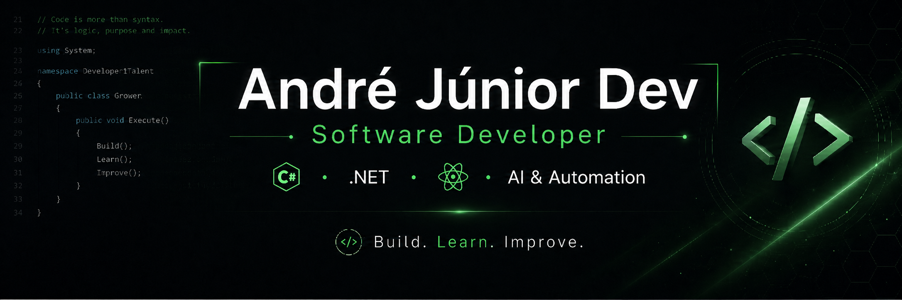

 

👨‍💻 Sobre mim

🎓 Estudante de Sistemas de Informação

💻 Foco em C# / .NET e desenvolvimento backend

🌐 Desenvolvendo aplicações web, APIs e produtos digitais

⚛️ Trabalhando também com React, TypeScript e Supabase

🤖 Explorando IA, automações e integrações

🚀 Transformando ideias em projetos e produtos reais

📚 Em evolução constante em arquitetura, backend e desenvolvimento de software

🛠️ Tech Stack

🚀 Projetos em destaque

🧠 Nexa Focus

Sistema de evolução pessoal que reúne produtividade, rotina, hábitos, academia, alimentação e finanças em uma única experiência.

Stack: React • TypeScript • Supabase • IA

📚 BookStore API

API desenvolvida em .NET com foco em boas práticas de backend, organização de código e APIs REST.

Stack: C# • .NET • REST API

🐾 PetFolio

Projeto backend voltado para gerenciamento de informações de pets, desenvolvido durante meus estudos de arquitetura e APIs.

Stack: C# • .NET

## 🐍 Contribuições

<picture>
  <source media="(prefers-color-scheme: dark)" srcset="https://raw.githubusercontent.com/AndreSilvaJrDev/AndreSilvaJrdev/output/github-contribution-grid-snake-dark.svg" />
  <source media="(prefers-color-scheme: light)" srcset="https://raw.githubusercontent.com/AndreSilvaJrDev/AndreSilvaJrdev/output/github-contribution-grid-snake.svg" />
  
</picture>

 

### Code. Build. Learn. Improve. 🚀

🌐 Contato

Build. Learn. Improve. 🚀

